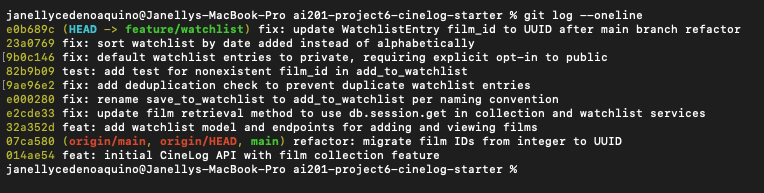

# PR Response Doc — CineLog Watchlist Feature

## AI Usage
I used Claude (Claude Code) throughout this project in a few distinct ways:

- **Orientation (Milestone 1):** Before reading any review comments, I had Claude summarize `models.py`, `services/collection_service.py`, and `tests/test_collection.py` — what each file does, the `verb_to_noun` naming convention, and the fixture/assertion structure the tests follow. This made Comments 1–3 much clearer once I read them, since I already recognized the patterns being referenced.
- **Stress-testing Comment 4 (default visibility):** I already leaned toward changing `public=True` to `public=False`, but wasn't sure my reasoning was solid. I talked it through with Claude, which pointed out something I hadn't considered on my own: the API currently has no way for a user to set `public` at all, so the existing default isn't really "a default" in the normal sense — it's the only outcome, for every user, with zero input. That reframing (and the "retroactive consent" problem — whoever's data is exposed once a social feature ships was never actually asked) sharpened my final argument, but the position itself (private-by-default) and the decision to change it were mine from the start.
- **Stress-testing Comment 5 (sort order):** I was genuinely torn between alphabetical (findability) and date-added (the reviewer's preference). Claude pointed out that `get_collection()` already sorts by `date_added.desc()` — an existing precedent in this exact codebase for the more similar feature — which is what tipped me toward agreeing with the reviewer instead of defending alphabetical.
- **Verification, not authorship:** For code changes (the rename, the dedup logic, the test), I wrote the logic myself and used Claude to verify — e.g., confirming via `grep` that no other call sites of `save_to_watchlist()` were missed, and confirming test results with `pytest`. 
- **Commit hygiene:** Before finalizing, I had Claude review my `git log --oneline` output for conventional-commit-format issues and bundled logical changes — no issues were found.

## Comment 1 — Rename
> `save_to_watchlist()` should follow the project's naming convention. Compare with `add_to_collection()` — the pattern here is `verb_to_noun`. Please rename to `add_to_watchlist()` and update all call sites.
> — @dev-lead, `services/watchlist_service.py:12`

**What I did:** Renamed `save_to_watchlist()` to `add_to_watchlist()` in `services/watchlist_service.py` to match the project's `verb_to_noun` convention used elsewhere (`add_to_collection()`, `remove_from_collection()`).

**How I verified:** Ran `grep -rn "save_to_watchlist" --include="*.py" .` across the repo before editing to find every reference (3 total: the definition, the import, and the call site in `routes/watchlist/watchlist.py`). Updated all three, then re-ran the same grep — zero matches for the old name. Ran `pytest tests/ -v` to confirm the existing test suite (4 tests) still passes.

## Comment 2 — Deduplication
> What happens if a user calls this with a film that's already on their watchlist? The current implementation would add a duplicate entry. Please handle this case.
> — @dev-lead, `services/watchlist_service.py:30`

**What I did:** Added deduplication logic to `add_to_watchlist()` in `services/watchlist_service.py`, mirroring the pattern in `add_to_collection()`: after confirming the film exists, query for an existing `WatchlistEntry` matching `user_id` + `film_id` via `.filter_by(...).first()`, and raise before inserting if one is found. Defined a new `AlreadyInWatchlistError` exception in `watchlist_service.py` rather than reusing `collection_service.py`'s `AlreadyInCollectionError`, since the two errors represent different domains (collection vs. watchlist) and a caller should be able to distinguish them.

**How I verified:** Initially reused `AlreadyInCollectionError` imported from `collection_service.py` to raise on a watchlist duplicate — on review, caught that this conflated two domains under one exception class and would prevent callers from telling a collection duplicate apart from a watchlist duplicate. Replaced it with a locally-defined `AlreadyInWatchlistError`, matching the naming convention of `collection_service.py`'s own exception classes. Ran `pytest tests/ -v` after the change to confirm the existing 4 tests still pass (no `test_watchlist.py` yet — that's Comment 3).

## Comment 3 — Missing test
> Please add a test for the case where `film_id` doesn't exist in the database. Look at the existing tests in `test_collection.py` — the pattern is there.
> — @dev-lead, general PR comment

**What I did:** Created `tests/test_watchlist.py` with `test_add_to_watchlist_nonexistent_film_raises`, modeled directly on `test_add_to_collection_nonexistent_film_raises` in `test_collection.py`. Reused the same `app` and `sample_user` fixture structure (in-memory SQLite, created/torn down per test) and the same fake-UUID approach (`"00000000-0000-0000-0000-000000000000"`) to assert `add_to_watchlist()` raises `FilmNotFoundError` for a film that doesn't exist. No `sample_film` fixture needed, since the collection test it's modeled on doesn't use one either — the point of the test is the nonexistent case.

**How I verified:** Ran `pytest tests/test_watchlist.py -v` to confirm the new test passes on its own, then `pytest tests/ -v` to confirm all 5 tests across both files pass together with no regressions.

## Comment 4 — Default visibility
> I notice watchlists default to `public=True`. We don't have a documented decision on default visibility for user lists. Before I can approve this, I need you to add a note to your PR description explaining your reasoning. I want to make sure we're being intentional here, not just inheriting a default.
> — @dev-lead, general PR comment

**My position:** I changed the default from `public=True` to `public=False`. Watchlist entries should be private unless a user explicitly chooses to share them.

**Reasoning:** Right now there is no way for a user to set `public` themselves — `POST /watchlist/<user_id>/add` only accepts `film_id`. That means the current `True` default isn't really a "default" in the normal sense of "the value most users would pick if asked" — it's the *only* outcome, applied to every entry, for every user, with no exceptions and no input from anyone. If we're going to force one outcome on all users until a visibility toggle exists, it should be the outcome that doesn't expose anything they didn't choose to expose. A watchlist can reveal more than someone intends to share — what they're planning to watch, when, and why — and none of that should become visible without some action on their part.

**Tradeoff acknowledged:** CineLog is a *community* film tracking app, and a private-by-default watchlist means the social/discovery value of watchlists (friends seeing what you want to watch) starts at zero engagement until users manually opt in — most users never change a default, so this could make any future "browse watchlists" feature launch quieter than it would with `public=True`. I'm accepting that tradeoff because the failure modes aren't symmetric: an overly private default just means slower adoption of a social feature, which is fully recoverable later with an onboarding prompt or UI nudge. An overly public default means real exposure — someone's data being visible before they ever decided that was okay — and that can't be undone once it's happened. I'd rather under-share by default and let users opt in than expose everyone by default and hope no one minds.

## Comment 5 — Sort order
> I'd prefer watchlists to default to "date added" order rather than alphabetical. Most users want to see what they added recently. I'm open to discussion if you see it differently — but let's make a decision and document it.
> — @dev-lead, `services/watchlist_service.py:50`

**My position:** I agree with the reviewer. Changed `get_watchlist()` in `services/watchlist_service.py` to sort by `WatchlistEntry.date_added.desc()` (newest first), replacing the previous `Film.title.asc()` (alphabetical).

**Reasoning:** `get_collection()` in `collection_service.py` already sorts the analogous "already watched" list by `date_added.desc()`. Watchlist and collection are the two most similar list views in the app, and having one sort by recency while the other sorts alphabetically was an inconsistency with no clear justification — a user familiar with how their collection displays would reasonably expect their watchlist to behave the same way.

**Engagement with reviewer's point:** The reviewer's argument was that most users want to see what they added recently, and I don't have a reason to disagree — if anything, the existing `get_collection()` precedent suggests the product already made this same UX bet once and it's worked. The main case for alphabetical (finding a specific title, or checking whether you already added something) is largely handled elsewhere now: Comment 2's deduplication logic already prevents duplicate entries at the service layer, so alphabetical order isn't doing much load-bearing work for that use case anymore. A future "let the caller choose sort order via a query param" option could still be worth exploring later (similar to how `routes/films.py` supports `?genre=` and `?year=` filters), but that's a bigger, separate feature than what this comment is asking for — a decision on the default.

## Comment 6 — Rebase
> A refactor merged to `main` that changed film IDs from integers to UUIDs. Your watchlist code still references integer IDs. Please rebase on `main` and update accordingly.
> — @dev-lead, general PR comment

**What conflicted:** Ran `git fetch origin` then `git rebase origin/main`. `main` had merged a refactor (`refactor: migrate film IDs from integer to UUID`) that changed `Film.id` and `CollectionEntry.film_id` from `db.Integer` to `db.String(36)` in `models.py`, while my branch's commits also touched `models.py` to add the `WatchlistEntry` model with an integer `film_id`. Git flagged `models.py` as conflicting since both sides modified overlapping parts of the file.

**How I resolved it:** Resolved the conflict in favor of `main`'s UUID-based `Film`/`CollectionEntry` definitions while keeping my `WatchlistEntry` model. After the rebase completed, I found `WatchlistEntry.film_id` was still declared as `db.Integer` — the conflict resolution hadn't carried the UUID migration over to the new model, since `WatchlistEntry` didn't exist yet when the refactor was originally written. Updated it to `db.String(36)` to match `Film.id`, and updated two stale docstrings (in `add_to_watchlist()` and the `add_film` route) that still described `film_id` as an integer.

**How I verified no conflict remains:** Confirmed no leftover conflict markers with `grep -rn "<<<<<<<\|=======\|>>>>>>>" --include="*.py" .` (no matches) and no `.orig` files. Confirmed the branch history is linear with `git log --oneline --graph origin/main..HEAD` — no merge commits. Ran `pytest tests/ -v` — all 5 tests pass.

After the interactive rebase to clean up commit messages (see Milestone 4), the final history looks like this:



## PR Description
<!-- Written at the end — feature overview, design decisions, manual testing steps -->

### What this feature does
Adds a watchlist to CineLog — a list of films a user wants to watch later, separate from their collection of already-watched films. Users can add a film to their watchlist (`POST /watchlist/<user_id>/add`) and view it (`GET /watchlist/<user_id>`). Adding the same film twice is rejected instead of creating a duplicate entry.

### Design decisions
- **Default visibility (`public`):** Changed the default from `True` to `False`. There's currently no way for a user to set this field themselves, so whatever the default is applies to every entry with no user input at all — it should be the option that doesn't expose anything a user didn't choose to share. See Comment 4 above for the full reasoning.
- **Sort order:** Watchlists are now sorted by `date_added` descending (newest first), matching how `get_collection()` already sorts the collection view. See Comment 5 above for the full reasoning.

### How to manually test
1. Seed a user and film via a Python shell (no API endpoint exists for this yet):
   ```python
   from app import create_app, db
   from models import User, Film
   app = create_app()
   with app.app_context():
       user = User(username="testuser", email="test@example.com")
       film = Film(title="Paddington 2", year=2017)
       db.session.add_all([user, film])
       db.session.commit()
       print(user.id, film.id)
   ```
2. With `python app.py` running, add the film to the watchlist:
   ```bash
   curl -X POST http://127.0.0.1:5000/watchlist/<user_id>/add \
     -H "Content-Type: application/json" -d '{"film_id": "<film_id>"}'
   ```
3. Repeat the same request — it should be rejected as a duplicate instead of creating a second entry.
4. Run `pytest tests/ -v` to confirm the same behavior automatically.
